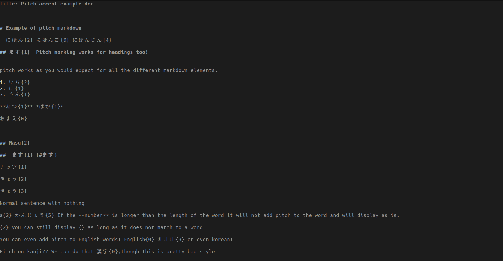
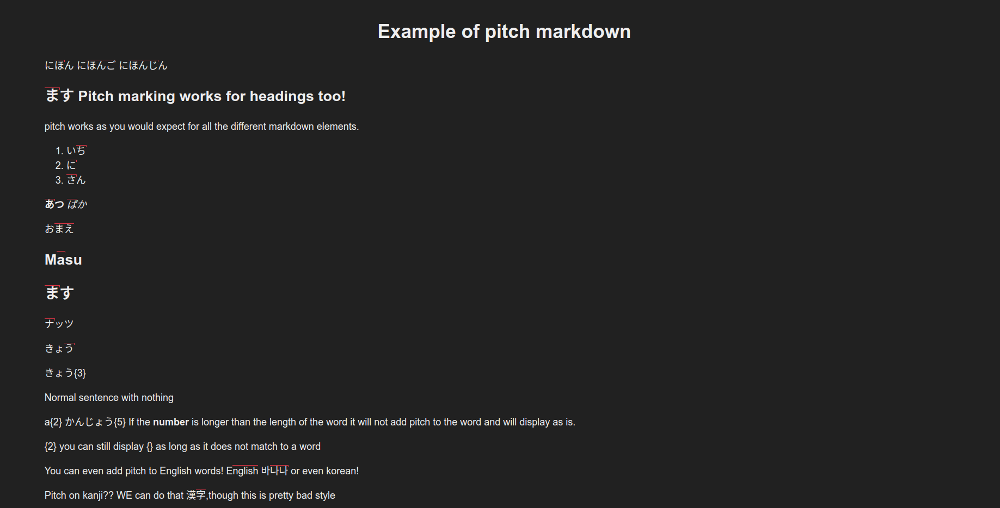

 hashi
 ==

A static site generator that converts Markdown into HTML with support for
japanese pitch notation( はし{2} ) and with no forced file hierachy.


## Features

* Easily write pitch accent べんきょう{0} gets processes into HTML that is searchable and looks appealing.
* No forced file hierachy, no complicated file structure to learn, you choose how you want to organize your site.
* Extensible.
* Fast.

## Installation

Download the binaries provided on github or download it using go get.

	# go get github.com/xythh/hashi 

## Layouts

layouts are placed in the .hashi folder. layouts are simple HTML pages with variables that lay out how a page should be build. The default layout expected is layout.html but you can use any other as long as you change the frontmatter(more on this soon).

```
<!DOCTYPE html>
<html lang="en">
	<head>
		<meta content="text/html; charset=UTF-8" http-equiv="Content-Type">
		<meta name="viewport" content="width=device-width,initial-scale=1.0">
		<link href="styles.css" rel="stylesheet" type="text/css">
		<link rel="icon" href="data:,">
	</head>
	<body>
{{content}}
</body>
```
In this example we have a basic layout for how our page will look, the part that concerns us is the variable {{content}}. at build time, any file that has this as its defined layout, will build following this layout but will replace {{content}} with the files content converted into HTML.

### default variables.


Turns



To




# Commands

`hashi build` If ran with no arguments builds all the files in the directory except for files or directories that start with a dot. If ran with an argument it builds only that file.

`hashi watch` bulds files as they are modified.

